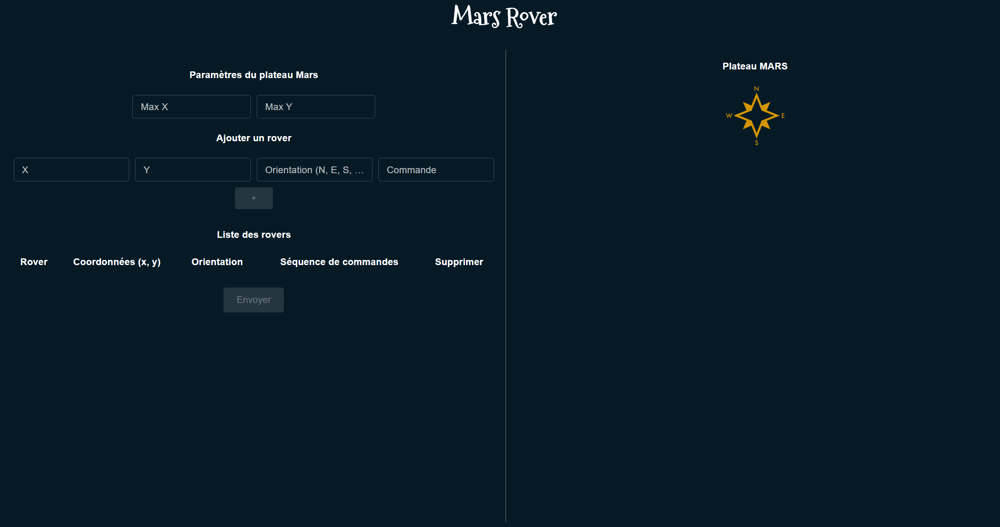
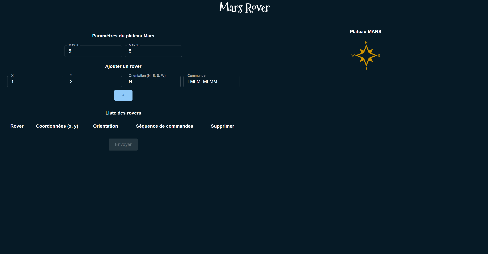
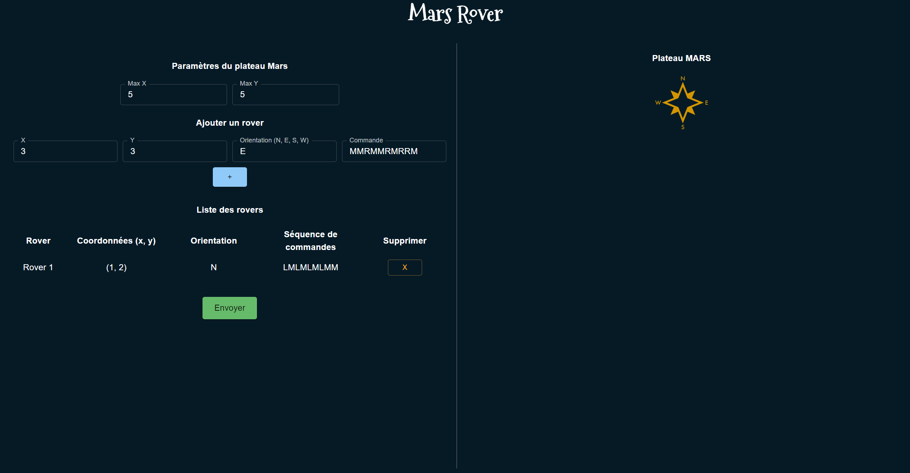

# Mars Rovers

Mars Rovers est une application de simulation de rovers se déplaçant sur un plateau sur Mars. L'application est accessible via une interface web et a été développée en utilisant React pour le frontend et FastAPI pour le backend.

## Fonctionnalités

- Création d'un plateau avec des coordonnées maximales définies par l'utilisateur.
- Ajout de rovers avec des coordonnées initiales et une orientation définies par l'utilisateur.
- Exécution d'une séquence de commandes pour déplacer chaque rover.
- Les rovers restent dans les limites du plateau et ne peuvent pas se déplacer dans un obstacle (mur ou autre rover).
- Les rovers ne peuvent pas être ajouté sur la même position qu'un autre rover.
- Les rovers se déplacent de manière séquentielle, c'est-à-dire que le premier rover doit terminer sa séquence de mouvements avant que le deuxième rover ne commence à se déplacer.

## Comment utiliser

1. Clonez ce dépôt sur votre machine locale.

```bash
git clone https://github.com/kevinZG-dev/mars-rovers-app.git
cd mars-rovers-app
```

2. Dans un terminal, lancez le back-end.
```bash
cd backend
pipenv shell
# Install dependencies
pipenv install
# Start the back-end development server
uvicorn main:app --reload
```

3. Dans un autre terminal, lancez le front-end.
```bash
cd frontend
# Install dependencies (use npm or yarn)
npm install
# Start the front-end development server
npm start

```
4. Accédez à l'URL `http://localhost:3000` dans votre navigateur pour utiliser l'application.



## Exemple d'utilisation

Voici un exemple d'utilisation de l'application :

- L'interface utilisateur de l'application web vous permet de saisir les coordonnées maximales du plateau. Vous pouvez également ajouter un premier rover avec ses coordonnées initiales, son orientation et une séquence de commande qu'il exécutera, en cliquant sur le bouton +.



- Il est possible d'ajouter d'autres rover en rempliçant les mêmes champs et en cliquant sur le +. La liste des rovers est récapitulée en dessous.



- Vous pouvez lancer la mission en cliquant sur le bouton envoyer. Les positions finales des rovers sont affichées sur un plateau avec leur orientation.


On peut voir que le premier rover est à la position (1, 3) et fait face au nord, et que le deuxième rover est à la position (5, 1) et fait face à l'est.

## Tests

Pour exécuter les tests pour l'application Mars Rovers, suivez les étapes suivantes :

1. Naviguez jusqu'au dossier `backend` dans le terminal.
2. Exécutez la commande `pytest` pour exécuter les tests du backend.

Les tests utilisent le framework de test `pytest` et afficheront les résultats dans la console avec les détails des tests exécutés. Il vérifient le bon fonctionnement des différentes fonctionnalités de l'application, y compris la création du plateau, l'ajout des rovers, l'exécution des commandes et la vérification des positions finales.
